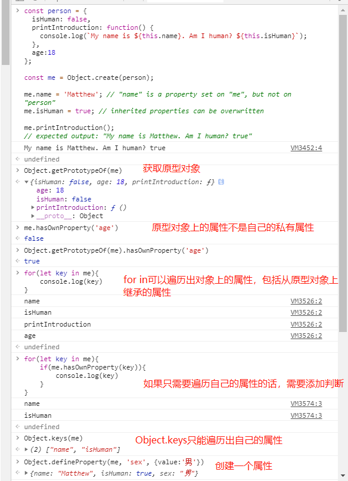
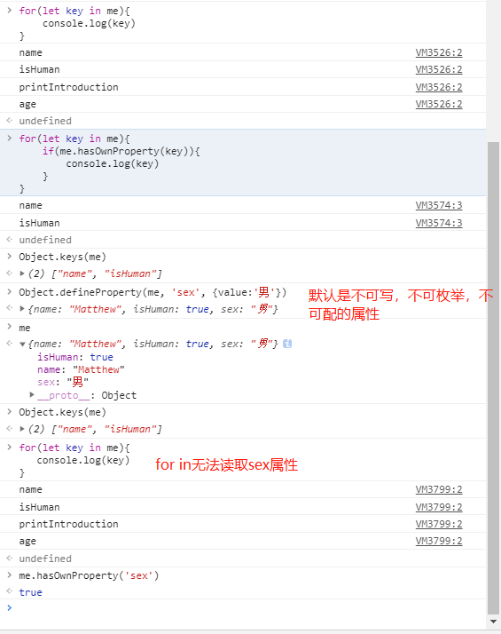
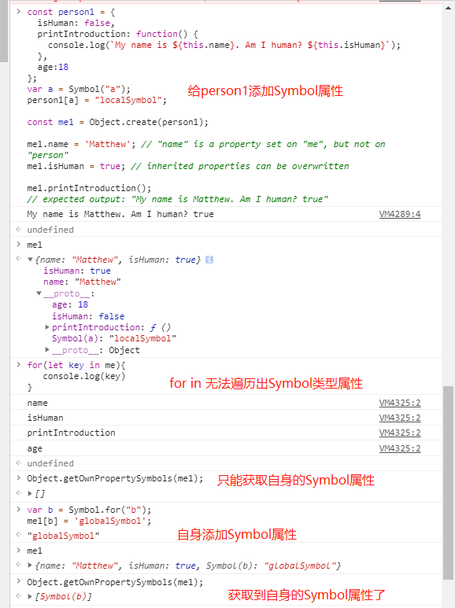

# 原型链的理解

定义：每个实例对象（`object`）都有一个私有属性（称之为 `proto` ）指向它的构造函数的原型对象（`prototype` ）。该原型对象也有一个自己的原型对象( `proto` ) ，层层向上直到一个对象的原型对象为 `null`。根据定义，`null` 没有原型，并作为这个原型链中的最后一个环节。这个查找的过程，也就是常说的原型链。


```js
// 图1 Object实例-原型是Object
var obj = new Object();
console.log(obj instanceof Object); // true
console.log(Object.prototype.toString.call(obj)); // '[object Object]'
console.log(obj.__proto__ === Object.prototype); // true
Object.prototype.__proto__ = null;

function Foo() {}
var fn = new Foo();
// 图2 Foo实例-原型是Object start
console.log(fn instanceof Object); // true
console.log(Object.prototype.toString.call(fn)); // '[object Object]'
console.log(fn.__proto__ === Foo.prototype); // true
console.log(Foo.prototype.__proto__ === Object.prototype); // true
Object.prototype.__proto__ = null;
// end

// 图3 函数Foo-原型是Function
console.log(Foo instanceof Function); // true
console.log(Foo instanceof Object); // true
console.log(Object.prototype.toString.call(Foo)); // '[object Function]'
console.log(Foo.__proto__ === Function.prototype); // true
console.log(Function.prototype.__proto__ === Object.prototype); // true
Object.prototype.__proto__ = null;

// 图4 函数Function-原型是Function
Function.__proto__ = Function.prototype;
Function.prototype = Function.prototype;
console.log(Function instanceof Function); // true
console.log(Function instanceof Object); // true
console.log(Object.prototype.toString.call(Function)); // '[object Function]'
console.log(Function.__proto__ === Function.prototype); // true
console.log(Function.prototype.__proto__ === Object.prototype); // true
Object.prototype.__proto__ = null;
```

图 1：对象实例的原型链


图 2：函数实例的原型链


图 3：构造函数的原型链


图 4：构造函数-Function 的原型链


## 归纳

- function (){}---类型为 Function
- new Function()--类型为 Function

- new Object()----类型为 Object
- new 构造函数-----类型为 Object

所有通过 new 出来的，除了`new Function`是`Function`外，其他的类型都是`Object`；

### 原型链：实例对象通过私有属性`__proto__`指向它的构造函数的原型对象`prototype`

明确两点：1️⃣`__proto__`和`constructor`是**对象独有的**。2️⃣`prototype`属性是**函数独有的**；但是在 JavaScript 中，函数也是对象，所以函数也拥有`__proto__`和 `constructor`属性。

**eg:**

实例(`f1`) -----`__proto__`-----> 构造函数(`function Foo(){}`)的原型对象(`Foo.prototype`) -----`__proto__`-----> 原型对象(`Object.prototype`) -----`__proto__`-----> `null`

**`constructor`:**

> 它是一个对象(`Foo.prototype`)指向一个函数，这个函数(`function Foo(){}`)就是该对象的构造函数。

-------------------------------- 构造函数(`function Foo(){}`) <-----指针`constructor`---- 原型对象(`Foo.prototype`)

**`prototype`：**

> 被定义为：给其它对象提供共享属性的对象。它是函数拥有的一个特别的属性，它是从一个函数(`function Foo(){}`)指向一个对象，这个对象（`Foo.prototype`）是函数的原型对象。

-------------------------------- 构造函数(`function Foo(){}`) -----指针`prototype`-----> 原型对象(`Foo.prototype`)

### `prototype` 和 `Object.getPrototypeOf()`

> prototype 是用于类的，而 Object.getPrototypeOf() 是用于实例的（instances），两者功能一致。

对于从 Java 或 C++ 转过来的开发人员来说，JavaScript 会有点让人困惑，因为它完全是动态的，都是运行时，而且不存在类（class）。所有的都是实例（对象）。即使我们模拟出的 “类”，也只是一个函数对象。

你可能已经注意到我们的 function A 有一个叫做 `prototype` 的特殊属性。该特殊属性可与 JavaScript 的 `new` 操作符一起使用。对原型对象的引用被复制到新实例的内部 [[Prototype]] 属性。例如，当执行 `var a1 = new A();` 时，JavaScript（在内存中创建对象之后，和在运行函数 `A()` 把 `this` 指向对象之前）设置 `a1.[[Prototype]] = A.prototype;`。然后当您访问实例的属性时，JavaScript 首先会检查它们是否直接存在于该对象上，如果不存在，则会 `[[Prototype]]` 中查找。这意味着你在 `prototype` 中定义的所有内容都可以由所有实例有效地共享，你甚至可以稍后更改部分 `prototype`，并在所有现有实例中显示更改（如果有必要的话）。

像上面的例子中，如果你执行 `var a1 = new A(); var a2 = new A();` 那么 `a1.doSomething` 事实上会指向 `Object.getPrototypeOf(a1).doSomething`，它就是你在 `A.prototype.doSomething` 中定义的内容。也就是说：`Object.getPrototypeOf(a1).doSomething == Object.getPrototypeOf(a2).doSomething == A.prototype.doSomething`（补充：实际上，执行 `a1.doSomething()` 相当于执行`Object.getPrototypeOf(a1).doSomething.call(a1)==A.prototype.doSomething.call(a1)`）

简而言之， `prototype` 是用于**类**的，而 `Object.getPrototypeOf()` 是用于**实例**的（`instances`），两者功能一致。

`[[Prototype]]` 看起来就像递归引用， 如 `a1.doSomething、Object.getPrototypeOf(a1).doSomething、Object.getPrototypeOf(Object.getPrototypeOf(a1)).doSomething` 等等等， 直到它被找到或 `Object.getPrototypeOf` 返回 `null`。

```js
//因此，当你执行：
var o = new Foo();

//JavaScript 实际上执行的是：
var o = new Object();
o.__proto__ = Foo.prototype;
Foo.call(o);

//然后，当你执行：
o.someProp;
```

它检查 `o` 是否具有 `someProp` 属性。如果没有，它会查找 `Object.getPrototypeOf(o).someProp`，如果仍旧没有，它会继续查找 `Object.getPrototypeOf(Object.getPrototypeOf(o)).someProp`。

——以上都摘自[MDN-继承与原型链](https://developer.mozilla.org/zh-CN/docs/Web/JavaScript/Inheritance_and_the_prototype_chain)

## 跟原型链相关的 API

获取原型对象：`Object.getPrototypeOf(obj)`，`obj.__proto__`，推荐使用前者。

判断对象自身属性中是否具有指定的属性：`obj.hasOwnProperty(prop:string | symbol)`。

遍历对象的方法：`for(let key in obj){}`,`Object.keys(obj)`,`Object.values(obj)`,`Object.getOwnPropertyNames(obj)`,`Reflect.ownKeys(target)`。

```js
const person = {
  isHuman: false,
  printIntroduction: function () {
    console.log(`My name is ${this.name}. Am I human? ${this.isHuman}`);
  },
  age: 18,
};

// 添加Symbol属性
var a = Symbol("a");
person1[a] = "localSymbol";

const me = Object.create(person);

me.name = "Matthew"; // "name" is a property set on "me", but not on "person"
me.isHuman = true; // inherited properties can be overwritten

me.printIntroduction();
// expected output: "My name is Matthew. Am I human? true"

Object.getPrototypeOf(me); // 获取me的原型对象-->person
me.hasOwnProperty("age"); // 判断me自身对象上是否有age属性 false
Object.getPrototypeOf(me).hasOwnProperty("age"); // 判断me的原型对象上是否有age属性 true

for (let key in me) {
  console.log(key);
}
// 依次输出 name isHuman printIntroduction age 可遍历自己的和继承的属性

Object.keys(me); // ["name", "isHuman"] 只能遍历自己的属性，继承的属性无法遍历

for (let key in me) {
  if (me.hasOwnProperty(key)) {
    console.log(key);
  }
}
// 依次输出 name isHuman

Object.defineProperty(me, "sex", { value: "男" }); // 给me添加属性，该属性默认不可枚举、不可被赋值、不可被修改或删除，具体要查看api
me.hasOwnProperty("sex"); // true

// 来看看添加过后，再遍历会发生什么？
for (let key in me) {
  console.log(key);
}
// 依次输出 name isHuman printIntroduction age 可遍历自己的和继承的属性，但只能遍历可枚举的属性

Object.keys(me); // ["name", "isHuman"] 只能遍历自己的可枚举的属性，继承的属性无法遍历

Object.getOwnPropertyNames(me); // ["name", "isHuman", "sex"] 返回所有自身属性的属性名（包括不可枚举属性但不包括Symbol值作为名称的属性）组成的数组。

// 获取自身的Symbol属性
Object.getOwnPropertySymbols(me); // []

// 给自身添加Symbol属性
var b = Symbol.for("b");
me[b] = "globalSymbol";

// 再次获取自身的Symbol属性
Object.getOwnPropertySymbols(me); //[Symbol(b)]

Reflect.ownKeys(me); //  ["name", "isHuman", "sex", Symbol(b)]
// 上下两个方式，结果相同
Object.getOwnPropertyNames(me).concat(Object.getOwnPropertySymbols(me)); // ["name", "isHuman", "sex", Symbol(b)]
```





### 对象循环方式的区别

- `for(let key in obj){}`：以任意顺序遍历一个对象的**除 Symbol 以外的可枚举属性**，循环只遍历**可枚举属性（包括它的原型链上的可枚举属性）**。
- `Object.keys(obj)`：方法会返回一个由一个给定对象的**自身可枚举属性**组成的数组，数组中属性名的排列顺序和正常循环遍历该对象时返回的顺序一致 。
- `Object.values(obj)`：方法返回一个给定对象**自身的所有可枚举属性值**的数组，值的顺序与使用`for...in`循环的顺序相同 ( 区别在于 `for-in` 循环枚举原型链中的属性 )。
- `Object.getOwnPropertyNames(obj)`：方法返回一个由指定对象的**所有自身属性(可枚举+不可枚举)**的属性名（包括**不可枚举属性**但**不包括 Symbol 值作为名称的属性**）组成的数组。
- `Object.getOwnPropertySymbols()`：方法返回一个给定对象**自身的所有 Symbol 属性**的数组。
- 静态方法`Reflect.ownKeys(target)`：方法返回一个由目标对象**自身的属性**键组成的数组。它的返回值等同于`Object.getOwnPropertyNames(target).concat(Object.getOwnPropertySymbols(target))`。

| API                               | 自生属性 | 原型链上的属性 | 可枚举 | 不可枚举 | 自身 Symbol | 原型链上的 Symbol | 返回值                    |
| --------------------------------- | :------: | :------------: | :----: | :------: | :---------: | :---------------: | :------------------------ |
| `for...in`                        |    √     |       √        |   √    |    ×     |      ×      |         ×         |                           |
| `Object.keys(obj)`                |    √     |       ×        |   √    |    ×     |      ×      |         ×         | 属性名组成的数组          |
| `Object.values(obj)`              |    √     |       ×        |   √    |    ×     |      ×      |         ×         | **属性值**组成的数组      |
| `Object.getOwnPropertyNames(obj)` |    √     |       ×        |   √    |    √     |      ×      |         ×         | 属性名组成的数组          |
| `Object.getOwnPropertyNames(obj)` |    ×     |       ×        |   /    |    /     |      √      |         ×         | **Symbol 属性**组成的数组 |
| `Reflect.ownKeys(target)`         |    √     |       ×        |   √    |    √     |      √      |         ×         | 属性名组成的数组          |

- 获取最全的自身属性：`Reflect.ownKeys(target)`---[可枚举的，不可枚举的，Symbol 属性]
- 只想获取自身可枚举属性：`Object.keys(obj)`，`Object.values(obj)`，`for...in`里面添加`obj.hasOwnProperty(prop:string | symbol)`的判断
- 想要连带获取原型链上的属性：`for...in`

## 继承

### 继承的方式

- 用`Object.create(proto, propertiesObject)`实现类式继承
- 原型继承
- 构造继承
- 实例继承
- call/apply 继承(组合继承)
- ES6 使用 class extends 继承

## 参考资料

- [【THE LAST TIME】一文吃透所有 JS 原型相关知识点](https://juejin.im/post/5dba456d518825721048bce9)
- [MDN-继承与原型链](https://developer.mozilla.org/zh-CN/docs/Web/JavaScript/Inheritance_and_the_prototype_chain)
- [js 原型链](https://www.jianshu.com/p/08c07a953fa0)
