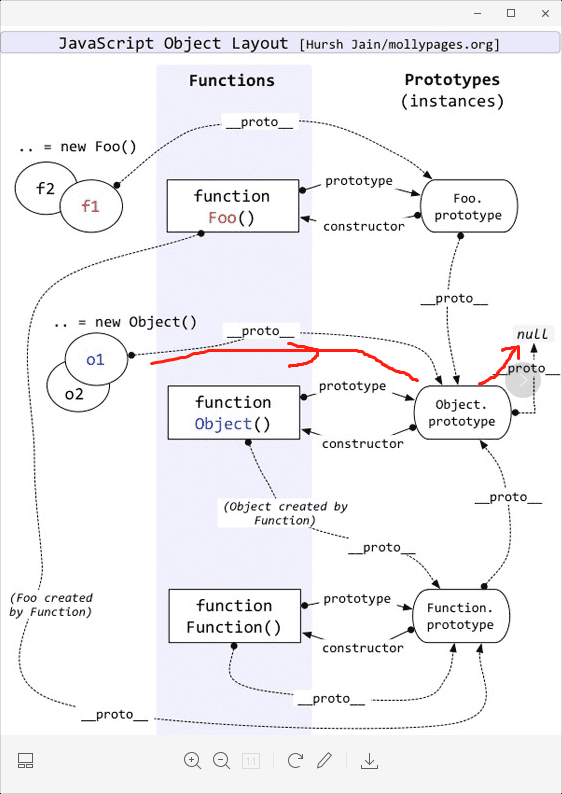

# 原型链的理解

定义：每个实例对象（`object`）都有一个私有属性（称之为 `proto` ）指向它的构造函数的原型对象（`prototype` ）。该原型对象也有一个自己的原型对象( `proto` ) ，层层向上直到一个对象的原型对象为 `null`。根据定义，`null` 没有原型，并作为这个原型链中的最后一个环节。这个查找的过程，也就是常说的原型链。


```js
// 图1 Object实例-原型是Object
var obj = new Object();
console.log(obj instanceof Object); // true
console.log(Object.prototype.toString.call(obj)); // '[object Object]'
console.log(obj.__proto__ === Object.prototype); // true
Object.prototype.__proto__ = null;

function Foo() {}
var fn = new Foo();
// 图2 Foo实例-原型是Object start
console.log(fn instanceof Object); // true
console.log(Object.prototype.toString.call(fn)); // '[object Object]'
console.log(fn.__proto__ === Foo.prototype); // true
console.log(Foo.prototype.__proto__ === Object.prototype); // true
Object.prototype.__proto__ = null;
// end

// 图3 函数Foo-原型是Function
console.log(Foo instanceof Function); // true
console.log(Foo instanceof Object); // true
console.log(Object.prototype.toString.call(Foo)); // '[object Function]'
console.log(Foo.__proto__ === Function.prototype); // true
console.log(Function.prototype.__proto__ === Object.prototype); // true
Object.prototype.__proto__ = null;

// 图4 函数Function-原型是Function
Function.__proto__ = Function.prototype;
Function.prototype = Function.prototype;
console.log(Function instanceof Function); // true
console.log(Function instanceof Object); // true
console.log(Object.prototype.toString.call(Function)); // '[object Function]'
console.log(Function.__proto__ === Function.prototype); // true
console.log(Function.prototype.__proto__ === Object.prototype); // true
Object.prototype.__proto__ = null;
```

图 1：对象实例的原型链



图 2：函数实例的原型链


图 3：构造函数的原型链


图 4：构造函数-Function 的原型链


### 总结

- function (){}---类型为 Function
- new Function()--类型为 Function

- new Object()----类型为 Object
- new 构造函数-----类型为 Object

所有通过 new 出来的，除了`new Function`是`Function`外，其他的类型都是`Object`；

#### 原型链：实例对象通过私有属性`__proto__`指向它的构造函数的原型对象`prototype`

明确两点：1️⃣`__proto__`和`constructor`是**对象独有的**。2️⃣`prototype`属性是**函数独有的**；但是在 JavaScript 中，函数也是对象，所以函数也拥有`__proto__`和 `constructor`属性。

**eg:**

实例(`f1`) -----`__proto__`-----> 构造函数(`Foo.prototype`) -----`__proto__`-----> 原型对象(`Object.prototype`) -----`__proto__`-----> `null`

**`constructor`:**

> 它是一个对象(`Object.prototype`)指向一个函数，这个函数(`Foo.prototype`)就是该对象的构造函数。

-------------------------------- 构造函数(`Foo.prototype`) <-----指针`constructor`---- 原型对象(`Object.prototype`)

**`prototype`：**

> 被定义为：给其它对象提供共享属性的对象。它是函数拥有的一个特别的属性，它是从一个函数(`Foo.prototype`)指向一个对象，这个对象（`Object.prototype`）是函数的原型对象。

-------------------------------- 构造函数(`Foo.prototype`) -----指针`prototype`-----> 原型对象(`Object.prototype`)

### 参考资料

- [【THE LAST TIME】一文吃透所有 JS 原型相关知识点](https://juejin.im/post/5dba456d518825721048bce9)
- [MDN-继承与原型链](https://developer.mozilla.org/zh-CN/docs/Web/JavaScript/Inheritance_and_the_prototype_chain)
- [js 原型链](https://www.jianshu.com/p/08c07a953fa0)
