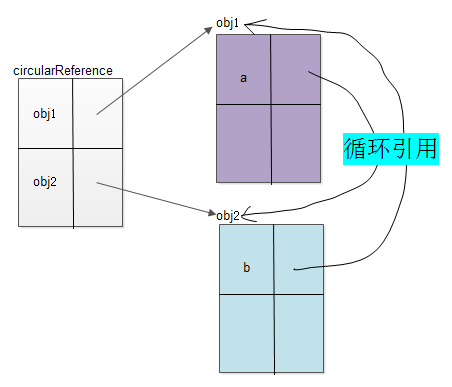

# 闭包

> 函数和对其周围状态（词法环境）的引用捆绑在一起构成**闭包**。也就是说闭包可以让你从内部函数访问外部函数作用域。

> 闭包概念中涉及到：词法作用域，作用域链概念。也有一些设计模式的知识。还需要再深度学习理解。

闭包是 `JavaScript` 中最强大的特性之一。`JavaScript` 允许函数嵌套，并且**内部函数**可以访问定义在**外部函数**中的所有**变量和函数**，以及外部函数能访问的所有变量和函数。

但是，外部函数却**不能**够访问定义在内部函数中的变量和函数。这给内部函数的变量提供了一定的**安全性**。

此外，由于内部函数可以访问外部函数的作用域，因此当内部函数生存周期大于外部函数时，外部函数中定义的变量和函数的生存周期将比内部函数执行时间长。_当内部函数以某一种方式被任何一个外部函数作用域访问时，一个闭包就产生了_。

## 典型面试题

```js
for (var i = 0; i < 5; i++) {
  setTimeout(() => {
    console.log(i);
  }, 1000);
}
//结果：1秒后输出5个5
```

解释：

1. **为什么是 5 个 5？**用`var`声明的变量是与`for`循环处在同样的作用域中，所以**变量`i`是全局变量，每一次循环，变量`i`的值都会发生变化**，`setTimeout`里面的`console.log(i)`中的`i`指向的是全局的`i`，也就是**每次遍历的时候设置的`setTimeout`里面的`console.log(i)`中的`i`指向的都是同一个`i`**，在最后运行输出的时候，其实`for`循环已经结束，**此时`i`是最后一轮的值**了，`i=4`遍历完后，执行`i++`，`i`变为`5`，不满足`i<5`的条件，**最终`i`为`5`**，所以是输出 5 个 5。
2. **那么为什么是 1 秒后一起输出呢？而不是我们想的每隔 1 秒输出一个呢？**js 在执行的时候遇到`setTimeout`，它的**异步执行有结果后会把它放入到`Tasks`(队-宏任务队列)中**。也就是每次遍历结束 1 秒后就会放一个`console.log(i)`到队列中，依次放入了 5 个。同步任务`for`循环执行的很快，几乎不需要时间，执行栈马上变为空了。1 秒后任务队列里面有任务出现，js 把`Task`中的任务，以先进先出的方式，依次添加到执行栈中执行，直到把所有的`Task`任务执行完。所以最终看到的表现就是 1 秒后输出 5 个 5。
3. 补充说明，所以说即便我延时的时间为 0，最后输出的任然是`5个5`，而不是期望的`0到4`。

> 涉及到变量作用域，js 事件循环机制，宏任务的知识点

### 怎么改一下能输出 0 到 4 呢？

1. 利用闭包——内部函数可以访问外部函数的作用域的特点来解决

```js
// 第一种
for (var i = 0; i < 5; i++) {
  (function () {
    var j = i;
    setTimeout(() => {
      console.log(j);
    }, 1000);
  })();
}

// 第二种
for (var i = 0; i < 5; i++) {
  (function (j) {
    setTimeout(() => {
      console.log(j);
    }, 1000);
  })(i);
}

// 第三种
function timer(i) {
  setTimeout(() => {
    console.log(i);
  }, 1000);
}
for (var i = 0; i < 5; i++) {
  timer(i);
}

// 第四种
function timer(i) {
  return function () {
    // 一个闭包
    setTimeout(() => {
      console.log(i);
    }, 1000);
  };
}
for (var i = 0; i < 5; i++) {
  timer(i)();
  // var delayed = timer(i); // 实例
  // delayed();
}

// 第五种
[0, 1, 2, 3, 4].forEach((i) => {
  setTimeout(() => {
    console.log(i);
  }, 1000);
});

// 第六种
var flat = function* () {
  for (var i = 0; i < 5; i++) {
    yield i;
  }
};

for (var f of flat()) {
  console.log(f);
}
```

第一种和第二种都是使用了**匿名闭包**的方式，第三种就是把代码抽取出来变成一个函数（不知道是不是也有高大上的说法），第四种是**函数工厂**（指这些内建函数都是类对象，当你调用他们时，实际上是创建了一个类实例。）写法上，个人认为第二种和第三种是一个道理，就是把参传进去。第一种和第四种就是很明显的利用了闭包的特点。

2. 利用 ES6 中的`let`命令所在的代码块内有效的性质来解决

```js
for (let i = 0; i < 5; i++) {
  setTimeout(() => {
    console.log(i);
  }, 1000);
}
```

3. 利用`setTimeout`方法的第三个参数——传给执行函数的其他参数，可传多个`param1, param2, ...`

```js
for (var i = 0; i < 5; i++) {
  setTimeout(
    (j) => {
      console.log(j);
    },
    1000,
    i
  );
}
```

以上通过三个不同的知识点，提出了 6 种解决方案。

### 怎么在上面的基础上，再改一下变成，可以让 0-4 是每隔 1 秒被打印出来呢？

1. 延时时间依次增加 1 秒

```js
for (let i = 0; i < 5; i++) {
  setTimeout(() => {
    console.log(i);
  }, 1000 * i);
}
```

2. 用 `Promise`

```js
// 第一种写法
function timer(i) {
  return new Promise((resolve) => {
    setTimeout(() => resolve(i), 1000 * i);
  });
}

for (var i = 0; i < 5; i++) {
  timer(i).then((j) => {
    console.log(j);
  });
}

// 第二种写法
function timer(i) {
  return new Promise((resolve) => {
    setTimeout(() => {
      console.log(i);
      resolve();
    }, 1000 * i);
  });
}

for (var i = 0; i < 5; i++) {
  timer(i);
}
```

3. 用`aynsc/await`

```js
function timer(ms) {
  return new Promise((resolve) => {
    setTimeout(resolve, ms);
  });
}
(async function () {
  for (var i = 0; i < 5; i++) {
    if (i > 0) {
      await timer(1000);
    }
    console.log(i);
  }
})();
```

4. 用`Generator`

```js
var gen = function* () {
  for (var i = 0; i < 5; i++) {
    yield i;
  }
};
var g = gen();
var timer = setInterval(() => {
  var result = g.next();
  if (result.done) {
    clearInterval(timer);
    return;
  }
  console.log(result.value);
}, 1000);
```

## 闭包的作用

- 封装变量
- 延续局部变量的寿命

## 闭包的缺点

- 内存泄漏：局部变量没有及时的销毁，利用闭包来存储的这些局部变量，本意就是想延续其寿命，把这些局部变量放到全局作用域中，对内存方面的影响是一致的。与内存泄漏有关的是，使用闭包的同时比较容易形成循环引用，如果闭包的作用域链中保存了**DOM 节点**，这时候就可能造成内存泄漏。但这本身非闭包的问题，与 IE 浏览器底层垃圾收集机制的实现有关，如果两个对象之间形成循环引用，那么这两个对象都无法被回收。

解释：在 IE 浏览器中，由于 BOM 和 DOM 中的对象是使用 C++以 COM 对象 的方式实现的，而 COM 对象的垃圾收集机制采用的是**引用计数策略**。在基于引用计数策略的垃圾回收机制中，如果两个对象之间形成了循环引用，那么这两个对象都无法被回收。但循环引用造成的内存泄露在本质上也不是闭包造成的。

### 循环引用

当 `obj1` 中的某个属性指向 `obj2`，`obj2` 中的某个属性指向 `obj1` 就会出现循环引用。

```js
function circularReference() {
  let obj1 = {};
  let obj2 = {
    b: obj1,
  };
  obj1.a = obj2;
}
```



### 引用计数策略

先简单讲一下 JS 中引用垃圾回收策略大体是什么样的一个原理，当一个变量被赋予一个引用类型的值时，这个引用类型的值的引用计数加 1。就像是代码中的 obj1 这个变量被赋予了 obj1 这个对象的地址，obj1 这个变量就指向了这个 obj1(右上)这个对象，obj1(右上)的引用计数就会加 1.当变量 obj1 的值不再是 obj1(右上)这个对象的地址时，obj1(右上)这个对象的引用计数就会减 1.当这个 obj1（右上）对象的引用计数变成 0 后，垃圾收集器就会将其回收，因为此时没有变量指向你，也就没办法使用你了。

看似很合理的垃圾回收策略为什么会有问题呢？

就是上面讲到的循环引用导致的，下面来分析一下。当 obj1 这个变量执行 obj1 这个对象时，obj1 这个对象的引用计数会加 1，此时引用计数值为 1，接下来 obj2 的 b 属性又指向了 obj1 这个对象，所以此时 obj1 这个对象的引用计数为 2。同理 obj2 这个对象的引用计数也为 2.

当代码执行完后，会将变量 obj1 和 obj2 赋值为 null，但是此时 obj1 和 obj2 这两个对象的引用计数都为 1，并不为 0，所以并不会进行垃圾回收，但是这两个对象已经没有作用了，在函数外部也不可能使用到它们，所以这就造成了内存泄露。

在现在广泛采用的**标记清除回收策略**中就不会出现上面的问题，标记清除回收策略的大致流程是这样的，最开始的时候将所有的变量加上标记，当执行 cycularReference 函数的时候会将函数内部的变量这些标记清除，在函数执行完后再加上标记。这些被清除标记又被加上标记的变量就被视为将要删除的变量，原因是这些函数中的变量已经无法被访问到了。像上述代码中的 obj1 和 obj2 这两个变量在刚开始时有标记，进入函数后被清除标记，然后函数执行完后又被加上标记被视为将要清除的变量，因此不会出现引用计数中出现的问题，因为标记清除并不会关心引用的次数是多少。

## 如何避免内存泄漏

我们只需要把循环引用中的变量设为 null 即可。将变量设置为 null 意味着切断变量与它此前引用的值之间的连接。当垃圾收集器下次运 行时，就会删除这些值并回收它们占用的内存。

```js
function assignHandler() {
  var element = document.getElementById("someElement");
  element.onclick = function () {
    alert(element.id);
  };
}
// 由于匿名函数中引用了element，所以element的引用数最少是1，导致占用的内存永远不会被回收，把这个就叫内存泄漏。
// 建议写法
function assignHandler() {
  var element = document.getElementById("someElement");
  var id = element.id;
  element.onclick = function () {
    alert(id);
  };
  element = null;
}

// 或者
function handleClick(e) {
  alert(e.target.id);
}

function assignHandler() {
  var element = document.getElementById("someElement");
  var id = element.id;
  element.onclick = handleClick;
}
```

## 参考文章

- [简单聊一聊 JS 中的循环引用及问题](https://blog.csdn.net/sinat_34560749/article/details/103922687?utm_term=javascript%E5%BE%AA%E7%8E%AF%E5%BC%95%E7%94%A8&utm_medium=distribute.pc_aggpage_search_result.none-task-blog-2~all~sobaiduweb~default-1-103922687&spm=3001.4430)
- 《JavaScript 设计模式与开发实践》——曾探
